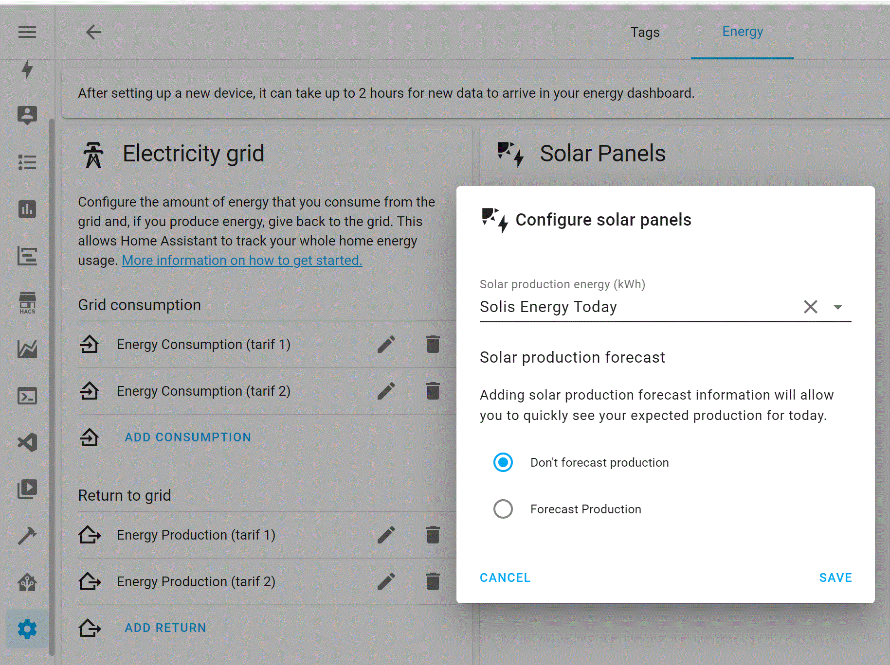
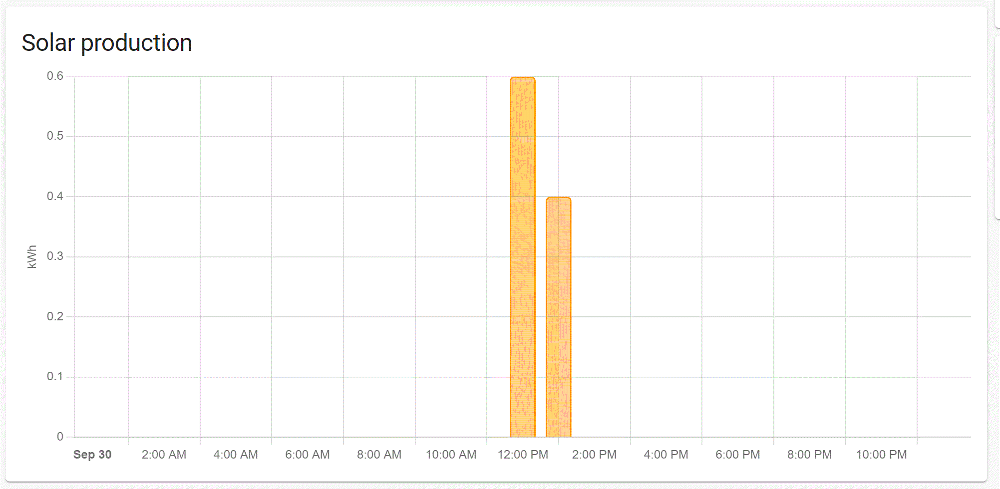

# Solis sensor integration
HomeAssistant sensor for Solis portal platform V2 (m.ginlong.com) backend. It logs in to the platform and exposes the data retrieved as sensors.
Also confirmed to work with:
* Solarman (home.solarman.cn)
* Sofar solar (home.solarman.cn)

> Platform V2 backend is used by Ginlong and MyEvolveCloud and the same backend is also used for different PV inverter brand portals. I've only tested it in context of Solis with the Ginlong platform. Let me know if it works with for other inverter types as well and I'll add them to the list of confirmed portals.
> :warning: This integration does not work with SolisCloud. See [Issue #18](https://github.com/hultenvp/solis-sensor/issues/18) for more details how to move to m.ginlong.com.

## HACS installation

The use of HACS is supported and is the preferred means of installing this integration.

## Manual installation

Create a directory called `solis` in the `<config directory>/custom_components/` directory on your Home Assistant instance.
Install this component by copying the files in [`/custom_components/solis/`]

"https://raw.githubusercontent.com/hultenvp/solis-sensor/master/custom_components/solis/__init__.py",
"https://raw.githubusercontent.com/hultenvp/solis-sensor/master/custom_components/solis/manifest.json"
"https://raw.githubusercontent.com/hultenvp/solis-sensor/master/custom_components/solis/const.py",
"https://raw.githubusercontent.com/hultenvp/solis-sensor/master/custom_components/solis/sensor.py",
"https://raw.githubusercontent.com/hultenvp/solis-sensor/master/custom_components/solis/service.py",
"https://raw.githubusercontent.com/hultenvp/solis-sensor/master/custom_components/solis/ginlong_api.py"
"https://raw.githubusercontent.com/hultenvp/solis-sensor/master/custom_components/solis/ginlong_consr.py"

This is how your custom_components directory should be:
```bash
custom_components
├── solis
│   ├── __init__.py
│   ├── manifest.json
│   ├── ginlong_api.py
│   ├── ginlong_const.py
│   ├── service.py
│   ├── const.py
│   └── sensor.py
```

## Configuration example

To enable this sensor, add the following lines to your configuration.yaml file:

``` YAML
sensor:
  - platform: solis
    name: "My Solis Inverter"
    portal_domain: "m.ginlong.com"
    portal_username: "my_portal_username"
    portal_password: "my_portal_password"
    portal_plant_id: "plantId goes here"
```

Configuration variables:

* **name** (Optional): Let you overwrite the name of the device in the frontend. *Default value: Solis*
* **portal_domain** (Optional): Portal domain name *Default value: m.ginlong.com*.
* **portal_username** (Required): Username of your portal account.
* **portal_password** (Required): Password of the portal account. 
> Note: The integration uses https to communicate with the portal, but the username and password are sent over in plain text!
* **portal_plant_id** (Required): PlantId on the platform the inverter belongs to, log into the portal to find the pland ID under tab "plants". The plantID must be a decimal value. 
> Dutch: Tab installatie: Installatie ID. 

The integration will detect automatically which data is available at the backend and create the relevant sensors. Names are backward compatible with old manual configuaration.

# Energy dashboard
The Solis integration now supports the energy dashboard introduced in Release 2021.8. 
> Note: This integration requires Home Assistant version 2021.9 or higher



